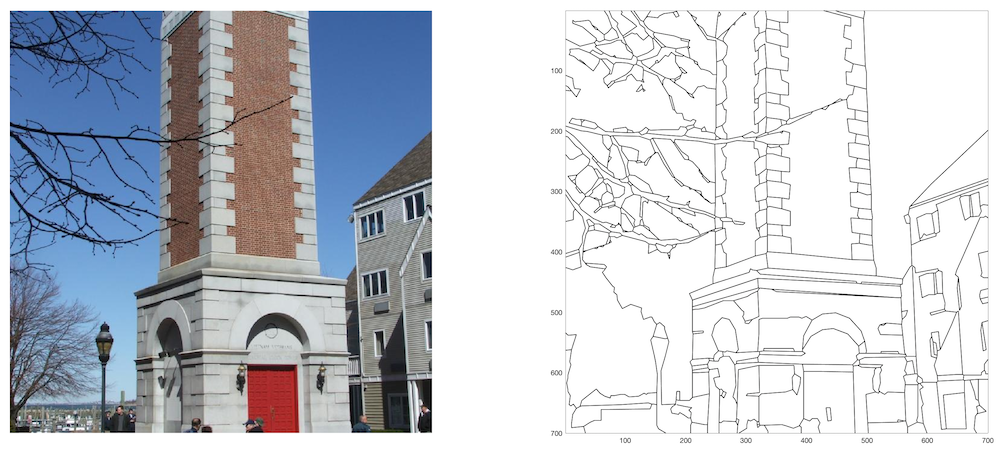
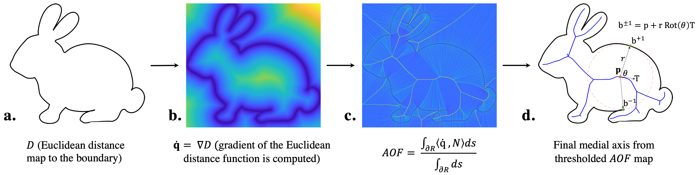
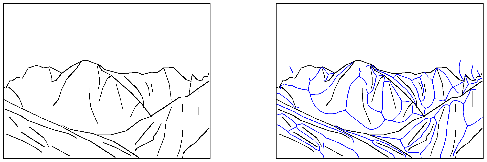
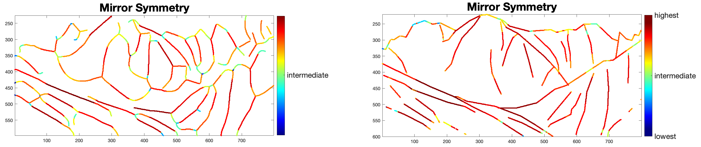

 
<hr>

The Mid-level Vision Toolbox (MLVToolbox) was created by the BWLab at the University of Toronto as a tool for researchers to extract structural properties of contours such as orientation, length, curvature and junctions present in images. MLVToolbox allows researchers to quantify the presence of perceptual organization cues such as mirror symmetry, ribbon symmetry, and taper symmetry using medial axis properties of contours in naturalistic images. MLVToolbox also provides researchers with a free and easy way to extract visual statistics that underlie our experience of surfaces, objects, scenes and even works of art. It will facilitate reproducible experimental stimulus sets using built-in functions that manipulate contours in images based on one or several mid-level vision properties. In addition, MLVToolbox offers several visualization functions for tracing contour orientations, lengths, curvature, junctions, as well as, medial axis properties on computer-generated and artist-generated line drawings. A contour extraction functionality helps users obtain computer-generated line drawings from real-world photographs. To encourage researcher's exploration of its potential, we have provided several example datasets produced using the MLVToolbox.

We are working on the python version and we have a plan to release the python version soon.<br> 
*_Please stay tuned for updates!_* 

## Table of Contents
- [Requirements](#Requirements)
- [Usage](#Usage)
- [Datasets](#Datasets)
- [FAQs](#FAQs)
- [References](#References)
- [License](#License)
- [Detailed Function Documentation](https://htmlpreview.github.io/?https://github.com/bwlabToronto/MLV_toolbox/blob/main/doc/index.html)


## Requirements

* [Matlab](https://www.mathworks.com/products/matlab.html)
* [Matlab Computer Vision Toolbox ](https://www.mathworks.com/products/computer-vision.html)
* [Matlab Image Processing Toolbox](https://www.mathworks.com/products/image.html)
* [Matlab Statistics and Machine Learning Toolbox](https://www.mathworks.com/products/statistics.html) 

## Usage

**Setup Path**

The first step to use the MLV toolbox is to add the required folders to the Matlab path. You can do this on Matlab's Graphical User Interface or by running the following line of code in the command window:

```matlab
setup
```


**Extracting Line Drawings**

The main function for extracting line drawings is "lineDrawingTracing.m". 

*_Please note that the line drawing extraction process can take a while to finish, depending on the image size._*

Example usage:

```
fileName= 'example.jpg';
vecLD = traceLineDrawingFromRGB(fileName);
figure;
subplot(1,2,1);
imshow(imread('example.jpg'));
subplot(1,2,2);
drawLinedrawing(veclD);
```

Output:

 

Note that the drawLineDrawing takes a LineDrawing (LD) data structure (represented as vecLD in the example above), and draws the outcome with specific line width (3 in the example above) and a chosen color ('b' -> which is for blue in Matlab). 

For a runnable matlab live code (.mlx), please refer to the [script](https://github.com/bwlabToronto/MLV_toolbox/blob/main/Demos/getLineDrawing.mlx). 

**Computing Medial Axis Properties**

 

Using MLV, one can compute accurate AOF-based medial axis transform (MAT) from binary images. These images can either be rendered from LineDrawing (LD) datastructures (check out renderLinedrawing.m function) or be binary images from other sources. Like the example (bunny) above shows, there are some intermediate steps in the process of extracting MAT, including the extraction of the distance map as well as the extraction of the average outward flux map (AOF). This information along with the skeleton is stored in the MAT computed from a binary image. Please see the following example of a mountain scene where the MAT is computed from the binary image. 

```
img = imread('images/mountain.png');
MAT = computeMAT(img,28);
figure;
subplot(1,2,1);
imshow(img);
subplot(1,2,2);
imshow(imoverlay(rgb2gray(img),MAT.skeleton,'b'))
```

Output:



In this example, 28 represents the object angle degree that the medial axis is thresholded at. For further information, please refer to the book: [Medial Representations](https://link.springer.com/book/10.1007/978-1-4020-8658-8). The higher the threshold, the less of medial axis branches are retained in the final representation.

The final MAT includes the following attributes in its data structure: 
- distance_map (step b)
- AOF (step c)
- skeleton (step d)

For a runnable Matlab live code (.mlx) with more examples to run, please refer to the [script](https://github.com/bwlabToronto/MLV_toolbox/blob/main/Demos/getMedialAxis.mlx).


**Computing Contour Properties**

Using the MLV toolbox, there are two major types of contour properties that one can compute:
- Medial-axis based properties
- Contour based properties


To compute medial-axis based properties, the user should first compute MAT representation first and then use the proper needed functions. Take a look at the following block of code as an example. 

```
load('dataSets/TorontoScenes/mountains_vecLD.mat');
cute = vecLD(11);
imgLD = renderLinedrawing(cute);
MAT = computeMAT(imgLD,28);
[MATcontourImages,MATskeletonImages,skeletalBranches]=computeAllMATproperties(MAT,imgLD);
figure;
subplot(1,2,1);
drawMATproperty(MATskeletonImages.mirror);
title('Mirror Symmetry','FontSize',24);
subplot(1,2,2);
drawMATproperty(MATcontourImages.mirror);
title('Mirror Symmetry','FontSize',24);
```

Output:

 

As shown above, we see the local mirror symmetry scores on an example LineDrawing (LD) structure, where colors show low to high scores from blue to red respectively. Check out a more detailed example Matlab Live Script (.mlv) [here](https://github.com/bwlabToronto/MLV_toolbox/blob/main/Demos/getMATScores.mlx). 

Similar to medial-axis based properties, one can also compute contour based properties using the MLV toolbox. Please take a look at the following block of code as an example.

```
load('dataSets/TorontoScenes/mountains_vecLD.mat');
cute = vecLD(11);
cute = computeContourProperties(cute);
figure;
subplot(1,2,1);
drawLinedrawingProperty(cute,['orientation']);
subplot(1,2,2);
drawLinedrawingProperty(cute,'junctions');
```

Output:

 

Again, check out a more detailed example Matlab Live Script (.mlv) [here](https://github.com/bwlabToronto/MLV_toolbox/blob/main/Demos/getcontourfeatures_Single.mlx). 

**Manipulating Line Drawings**

We are still working on this part of the documentation ...

**Batch Processing**

Will be available in future releases ...

## Datasets

We include several data sets, alread processed as vectorized line drawings:

* [TorontoScenes](dataSets/TorontoScenes/TorontoScenes_Readme.md) data set of 475 scene images
* International Affective Picture System ([IAPS](dataSets/IAPS/IAPS_Readme.md))
* A set of 200 [Architectural Scenes](dataSets/ArchitecturalScenes/ArchitecturalScenes_Readme.md)
* The Open Affective Standardized Image Set ([OASIS](dataSets/OASIS/OASIS_Readme.md))
* The 260 line drawings of objects from [Snodgrass and Vanderwart (1980)](dataSets/Snodgrass_Vanderwart/Snodgrass_Vanderwart_Readme.md)

## FAQs

We are working on this section, please make sure to check back here in the future. As of now, please ask your questions on the discussion page of the MLV toolbox available [here](https://github.com/bwlabToronto/MLV_toolbox/discussions). 

## References

If you use the MLV toolbox, we appreciate it if you cite the following papers as appropriate:

Walther, D. B., Farzanfar, D., Han, S., & Rezanejad, M. (2023). The mid-level vision toolbox for computing structural properties of real-world images. *Frontiers in Computer Science*, **5**. [doi: 10.3389/fcomp.2023.1140723](https://doi.org/10.3389/fcomp.2023.1140723)

Rezanejad, M., Downs, G., Wilder, J., Walther, D. B., Jepson, A., Dickinson, S., & Siddiqi, K. (2019). Scene categorization from contours: Medial axis based salience measures. In *Proceedings of the IEEE/CVF Conference on Computer Vision and Pattern Recognition* (pp. 4116-4124). [PDF](https://drive.google.com/file/d/1uEVoTjrYzdF-N0ZeR4_B8Le6N4jRtjyf/view?usp=drive_link)

Walther, D. B., & Shen, D. (2014). Nonaccidental properties underlie human categorization of complex natural scenes. *Psychological science*, **25**(4), 851-860. [PDF](https://drive.google.com/file/d/1tVlsjLdlL1mwCbFJhiZ6afGHNXO6-lf-/view?usp=drive_link)

Rezanejad, M., & Siddiqi, K. (2013). Flux graphs for 2D shape analysis (pp. 41-54). Springer London.


```
Bibtex:

@article{walther2023mid,
  title={The mid-level vision toolbox for computing structural properties of real-world images},
  author={Walther, Dirk B and Farzanfar, Delaram and Han, Seohee and Rezanejad, Morteza},
  journal={Frontiers in Computer Sciene},
  volume={5},
  year={2023},
  publisher={Frontiers}
}
@InProceedings{rezanejad2019scene,
author = {Rezanejad, Morteza and Downs, Gabriel and Wilder, John and Walther, Dirk B and Jepson, Allan and Dickinson, Sven and Siddiqi, Kaleem},
title = {Scene Categorization from Contours: Medial Axis Based Salience Measures},
booktitle = {The IEEE Conference on Computer Vision and Pattern Recognition (CVPR)},
month = {June},
year = {2019}
}
@article{walther2014nonaccidental,
  title={Nonaccidental properties underlie human categorization of complex natural scenes},
  author={Walther, Dirk B and Shen, Dandan},
  journal={Psychological science},
  volume={25},
  number={4},
  pages={851--860},
  year={2014},
  publisher={Sage Publications Sage CA: Los Angeles, CA}
}
@incollection{rezanejad2013flux,
  title={Flux graphs for 2D shape analysis},
  author={Rezanejad, Morteza and Siddiqi, Kaleem},
  booktitle={Shape Perception in Human and Computer Vision},
  pages={41--54},
  year={2013},
  publisher={Springer}
}

```

## License

The MLV toolbox contains various modules from different projects. Please take some time to check licenses on the released files. 


